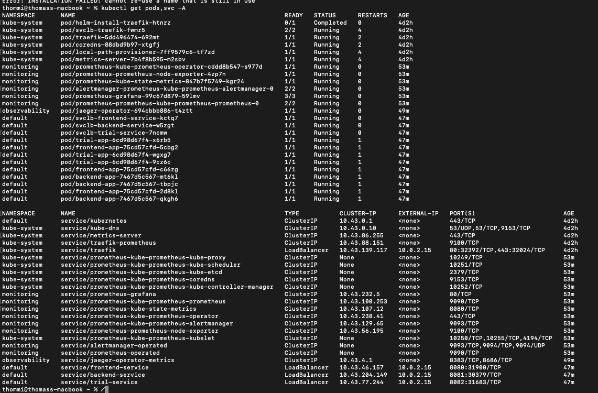
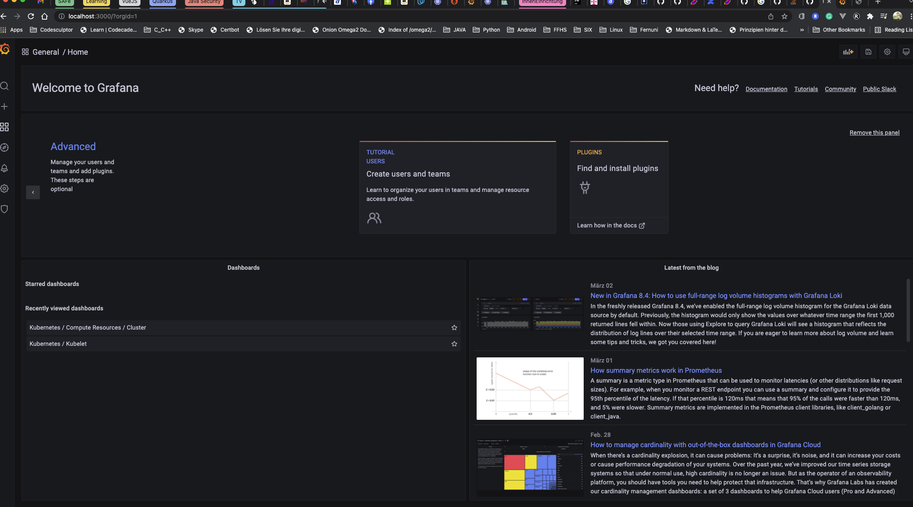
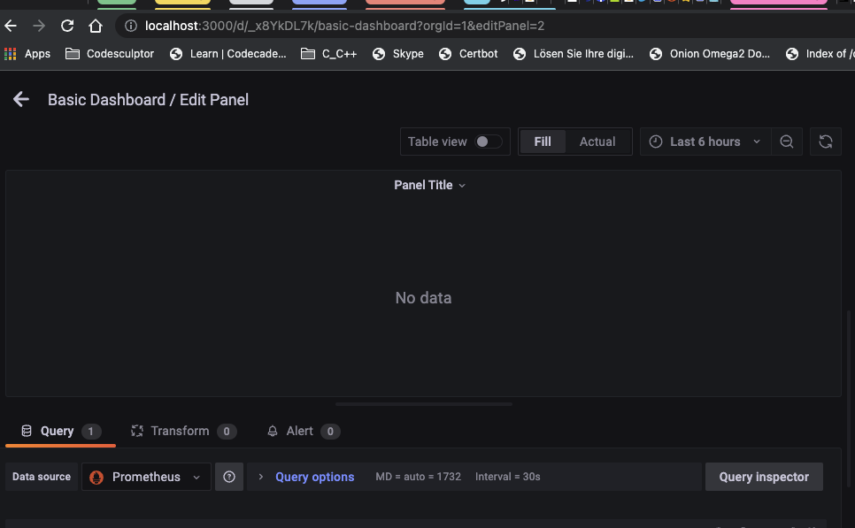
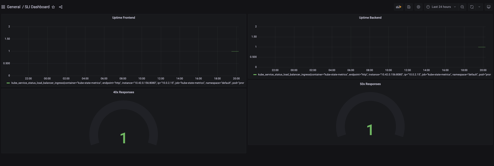
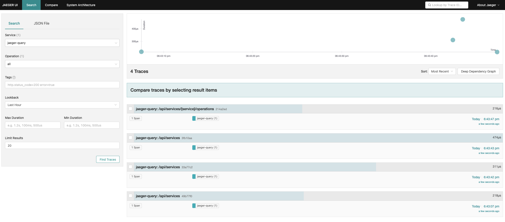
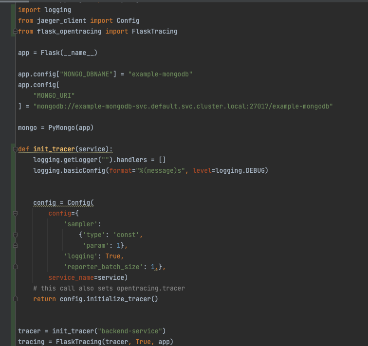
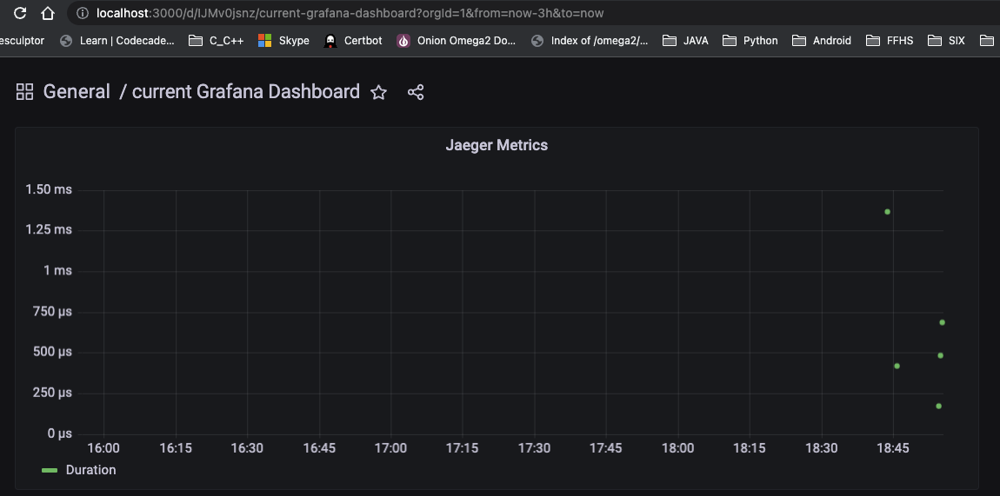

**Note:** For the screenshots, you can store all of your answer images in the `answer-img` directory.

## Verify the monitoring installation

run `kubectl` command to show the running pods and services for all components. Take a screenshot of the output and include it here to verify the installation

## Setup the Jaeger and Prometheus source
Expose Grafana to the internet and then setup Prometheus as a data source. Provide a screenshot of the home page after logging into Grafana.

## Create a Basic Dashboard
Create a dashboard in Grafana that shows Prometheus as a source. Take a screenshot and include it here.

## Describe SLO/SLI
Describe, in your own words, what the SLIs are, based on an SLO of *monthly uptime* and *request response time*.
* SLIs are Service Level Indicators. These are metrics which measured the service. For SLOs Service Level Objectives uptime it measures the availability of the service, e.g. the Healthcheck and for request response time it measures collected metrics based on the request and response time, usually displayed/calculated in percentiles.

## Creating SLI metrics.
It is important to know why we want to measure certain metrics for our customer. Describe in detail 5 metrics to measure these SLIs. 
1. 99 Percentile Response time: how fast a fast can process requests and provide a valuable response.
2. Response Status: The percentage of successful requests with response status 20x or 30x  vs. the unsuccessful requests with either 40x or even 50x response status. To see how many requests are successfully handled for our customers.
3. The average time a client requires to proceed a workflow. By fetching the initial request with a kind of span as tracing id. all following requests will be within the span until the last action has been taken.
4. Number of requests per hour. Be collecting the sum of requests for a defined timerange.
5. Number of new registrations per month. By fetching the new regisered users by either log-entries or by the database.
 
## Create a Dashboard to measure our SLIs
Create a dashboard to measure the uptime of the frontend and backend services We will also want to measure 40x and 50x errors. Create a dashboard that show these values over a 24 hour period and take a screenshot.

sum(increase(nginx_ingress_controller_requests{status=~"(1|2).*",  controller_class=~"$controller_class", ingress=~"$ingress", namespace=~"$namespace", controller_pod=~"$pod"}[$__interval])) or vector(0)
sum(rate(coredns_dns_response_rcode_count_total{job="coredns",instance=~"$instance"}[5m])) by (rcode) or
sum(rate(coredns_dns_responses_total{job="coredns",instance=~"$instance"}[5m])) by (rcode)

sum(irate(container_network_receive_packets_total{cluster="$cluster",namespace=~"$namespace"}[$interval:$resolution])) by (pod)

sum(irate(container_network_transmit_packets_total{cluster="$cluster",namespace=~"$namespace"}[$interval:$resolution])) by (pod)

sum(irate(container_network_receive_packets_dropped_total{cluster="$cluster",namespace=~"$namespace"}[$interval:$resolution])) by (pod)

sum(irate(container_network_transmit_packets_dropped_total{cluster="$cluster",namespace=~"$namespace"}[$interval:$resolution])) by (pod)

## Tracing our Flask App
We will create a Jaeger span to measure the processes on the backend. Once you fill in the span, provide a screenshot of it here. Also provide a (screenshot) sample Python file containing a trace and span code used to perform Jaeger traces on the backend service.

## Jaeger in Dashboards
Now that the trace is running, let's add the metric to our current Grafana dashboard. Once this is completed, provide a screenshot of it here.

## Report Error
Using the template below, write a trouble ticket for the developers, to explain the errors that you are seeing (400, 500, latency) and to let them know the file that is causing the issue also include a screenshot of the tracer span to demonstrate how we can user a tracer to locate errors easily.

TROUBLE TICKET

Name: Issue with Backend Service - error responses and latency

Date: 2022/04/04

Subject: backend-service

Affected Area: One Page Wonder

Severity: Error

Description: The One Page Wonder App has issues processing requests. Within Grafana you can have a look in the SLI Dashboard and the current Grafana Dashboard, displaying 40x Responses and 50x Responses as well as responses with high latency.

## Creating SLIs and SLOs
We want to create an SLO guaranteeing that our application has a 99.95% uptime per month. Name four SLIs that you would use to measure the success of this SLO.
1. Number of successful healthchecks vs. failed healthchecks within 1 month.
2. Number of < 500 http status responses vs. >= 500 http status responses within 1 month
3. Number of requests reached our periphery vs. number of requests reached our application wiht a successful response within 1 month
4. Number of successful HTTP requests vs. total HTTP requests within 1 month

## Building KPIs for our plan
*TODO*: Now that we have our SLIs and SLOs, create a list of 2-3 KPIs to accurately measure these metrics as well as a description of why those KPIs were chosen. We will make a dashboard for this, but first write them down here.
1. 

## Final Dashboard
*TODO*: Create a Dashboard containing graphs that capture all the metrics of your KPIs and adequately representing your SLIs and SLOs. Include a screenshot of the dashboard here, and write a text description of what graphs are represented in the dashboard.  
